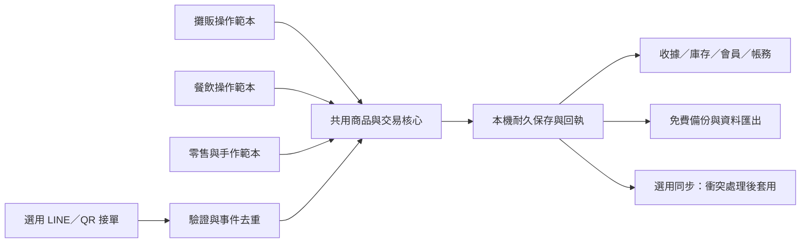

# POS Pro：全功能免費產品規格

日期：2026-10-07。狀態：使用者指定的產品方向與後續實作規格；不是新版功能已完成或已發佈的宣告。

讓原本沒有預算、設備或信心嘗試 POS 的店家，能用手邊手機、平板或電腦開始做生意，逐步用到完整管理能力。收銀、庫存、會員、報表、帳務與後續接單能力全部免費。

## 產品原則

1. 所有使用者與店家，不分規模、店型，所有產品功能免費。模式、員工權限與進階設定只決定操作流程及可見範圍，不作收費門檻。
2. 不以商品、訂單、員工或裝置數量設置付費解鎖；實際裝置容量、同步拓撲及外部服務配額必須如實說明。
3. 不要求購買專用收銀機、綁月租、申請雲端資料庫或提供信用卡才能開始。一般相機、瀏覽器及可匯出的收據是基礎路徑，周邊設備為選用。
4. 首次取得程式可需要網路；核心收銀在離線準備完成後仍可運作。LINE 接單和跨地點同步的連線條件另行清楚顯示。
5. 商家擁有自己的資料；完整備份、匯出、還原與搬到另一台裝置都免費。示範資料與正式營業資料必須分開。
6. 任何第三方可能收費的服務，先顯示供應商與費用／配額來源，由店家自行選擇。POS Pro 核心流程維持不依賴這些服務的做法。
7. 系統成功訊息必須來自已保存回執；未保存、結果不明、成本資料未填，都以人能理解的文字表示。
8. 企業等級的目標用交易不重複、帳務能核對、故障能復原、資料能帶走衡量；完整能力與其他產品的比較仍需同場景驗收。

## 全部店型共用核心，各有操作範本

| 店型 | 最常用操作 | 起步範本 | 額外流程 |
| --- | --- | --- | --- |
| 攤販／市集小攤 | 快速收款、找零、今天賣多少 | 大按鈕、常賣商品、單人收銀、現金開店額 | 臨時品項、活動場次、收攤對帳 |
| 餐飲外帶店 | 菜單、選項／加料、接單、叫號 | 餐點分類、取餐號、未付款清單 | 備餐狀態、售完、預訂截止；LINE／QR 為選用入口 |
| 個人零售／手作店 | 商品、條碼、庫存、退換貨 | 商品圖卡、庫存是否管理、簡單成本 | 批次商品、供應商、進貨及毛利分析 |

首輪三種店型一起驗收。之後增加個人服務／預約、團購及其他店型；使用相同交易核心和免費政策。尚未實作的服務預約、跨店、電子發票、支付串接等能力各自保留未完成狀態，不由範本名稱推定已支援。

## 第一次使用

1. 選操作範本，可隨時修改；選擇不會刪資料，也不會切換成不同付費等級。
2. 輸入店名，建立自己的本機管理身份／PIN。既有商家走資料遷移，不重設帳號。
3. 新增第一個商品，或預覽獨立示範資料。只填名稱、售價即可起步；成本、條碼、庫存管理、會員都可稍後補。
4. 以「開始今天」開店，讓使用者填現金起始額；不用先理解班別、總帳或雲端設定。
5. 點商品 → 確認金額 → 記錄收到的現金 → 保存成功 → 顯示找零與收據。刷卡／轉帳記錄不等於系統已向支付業者完成收款。
6. 首筆成功後提示「今天的資料已保存在這台裝置」及「備份一份」，並提供直接匯出動作。

首次正式收款前應能完成一次安全示範與備份說明。上手時間的目標為 5 分鐘內，尚需初次使用者實測，不能由開發者熟練操作推定。

## 起步畫面與進階能力

日常入口：收銀、商品／菜單、今天、設定。餐飲範本再提供待處理訂單。大字、觸控目標至少 44×44 CSS px，關鍵輸入在手機不得被鍵盤遮住；桌機亦可用鍵盤完成付款。

進階能力按需要展開：會員、點數／儲值、採購、供應商、庫存盤點、損耗、促銷、員工權限、帳務、詳細報表、同步。所有模組免費；切回簡單畫面保留原資料與設定。

產品文案使用「今天賣了多少」「目前未付款」「找零」「收攤」「備份」等具體用語。沒有成本時顯示「成本未填，毛利待計算」，不把未知當成零成本。

## 共同資料與交易架構

- 一份商店設定描述幣別、最小貨幣單位、時區、店型範本及模組偏好；不包含付費等級欄位。
- 商品具有永久身份、售價、選項及是否管理庫存。服務／現做餐點不需靠極大假庫存模擬不限量。
- 訂單保存下單當時的品項、售價、折抵、實收、找零、付款分配與可用成本快照；歷史訂單不依目前商品重新計價。
- 每次交易具備穩定 operationId／orderId 和已保存回執。重試、重送、重新開啟，不再次扣庫存、點數或金額。
- 跨商品、會員、訂單及庫存的異動在單一交易提交。桌面採 SQLite；手機／瀏覽器應採可交易的耐久儲存，IndexedDB 為首選候選；localStorage 保留設定／舊資料遷移用途。
- localStorage 舊資料遷移應先備份、驗證筆數與金額，成功後切換來源；失敗保留舊版資料。
- 單機持久化、多分頁／多裝置同步、對外接單分開驗收。同裝置沒有網路時的資料，不能被雲端登入 pull 覆蓋。
- 訂單來源可為現場、LINE、QR 或手動預訂，但都接同一套交易命令，避免每個入口維護自己的金額與庫存算法。

## LINE／QR 接單

「已接單」「已付款」「備餐／出貨進度」分開表示。接單或顯示付款 QR 不會自動成為已完成銷售；客人取消、店家取消及退款也分開處理。

LINE 接口必須在解析前驗證原始請求簽章，缺少／無效簽章拒絕；用事件編號耐久去重；保存成功才回覆單號。通知失敗不回滾已接訂單，也不重新建立訂單。免費預設以客人查詢／Reply 為主，主動通知需配額檢查與顯式啟用。

Google Sheets 可作菜單交換／只讀報表；直接編輯試算表不能繞過交易驗證。公開菜單只包含對客欄位，排除員工、成本、供應商或完整會員資料。

第三方價格與配額查核見 [LINE 專案學習紀錄](ORDER_LINEBOT_LEARNING.md)。

## 驗收目標與現況

| 目標 | 驗收條件 | 本次狀態 |
| --- | --- | --- |
| 全功能免費 | 所有模組沒有付費解鎖、到期鎖單、資料匯出收費或必需的付費雲端 | 產品原則已記錄；實作未完整驗收 |
| 三種店型都能起步 | 各用同一版程式與合成資料，完成建立商品、開店、收款、收攤、匯出 | 未實作新流程 |
| 無特殊設備 | 一般手機／平板／電腦完成上述流程，不連專用收銀設備 | 尚待實機驗收 |
| 可靠收銀 | 雙擊、保存拒絕、斷線、儲存空間不足、提交後當機均無假成功或重複交易 | 既有 R6 模組測試不等於主程式通過 |
| 離線可用 | 已完成離線準備後斷網收款，重開程式資料完整 | 尚待實機與持久化驗收 |
| 資料帶得走 | 同一資料集匯出、還原到另一測試裝置，單據／金額／庫存完整一致 | 需補完整測試 |
| 容易上手 | 初次使用者 5 分鐘內完成首次設定與示範收款；記錄失敗步驟 | 尚未量測 |
| 操作順暢 | 指定測試裝置本機保存與回執 p95 ≤ 500 ms；外部網路延遲另列 | 尚未量測，需凍結裝置基準 |
| 容量與效能 | 合成 1,000 商品／10,000 訂單測試集，數據完整且關鍵操作符合上述門檻 | 尚未量測；不是使用數量限制 |

360／390／768／1366 CSS px 版面是規劃的測試矩陣，另需實機相機、觸控、鍵盤、低網路與重新啟動驗收。與大企業產品的功能、效能或可靠性比較尚未量測。

後續開發依 [開發與驗收清單](FREE_POS_BACKLOG.md) 執行；先完成交易保存與故障復原，再建立起步體驗，之後整合接單與成長模組。
